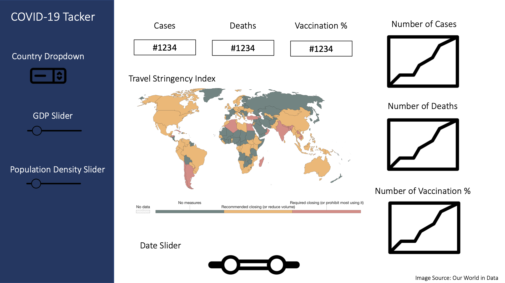

# COVID Visualization

## Authors

- Jenit Jain
- Ashwin Babu
- Bruce Wu
- Lennon Au-Yeung

This R-based dashboard is designed to provide travelers with COVID-19 information for them to assess their risk of contacting the disease while traveling to different countries. We have designed our dashboard to give the user flexibility to compare the number of cases, deaths and vaccinations percentage from different countries using the drop-down menus on the left. If users are interested to know if countries with similar characteristics have similar COVID-19 statistics, they can used the slider to filter countries based on their GDP and population density. There is also a date slider in the bottom of the dashboard to allow users to select a date interval if they are interested in knowing the progress of the pandemic in its earlier stages.

We are aiming to create 3 types of visualizations for within the dashboard. The first type is line graphs showing the progression of COVID-19 cases, deaths and vaccinations percentages according to the filters applied. The second type is a heatmap of the world map showing the travel stringency index of the world which reflects the strictness of government response due to the pandemic. The last type of visualization is number boxes showing the number of COVID-19 cases, deaths and vaccinations percentages according to the filters applied.

 

# License
Licensed under the terms of the MIT license.